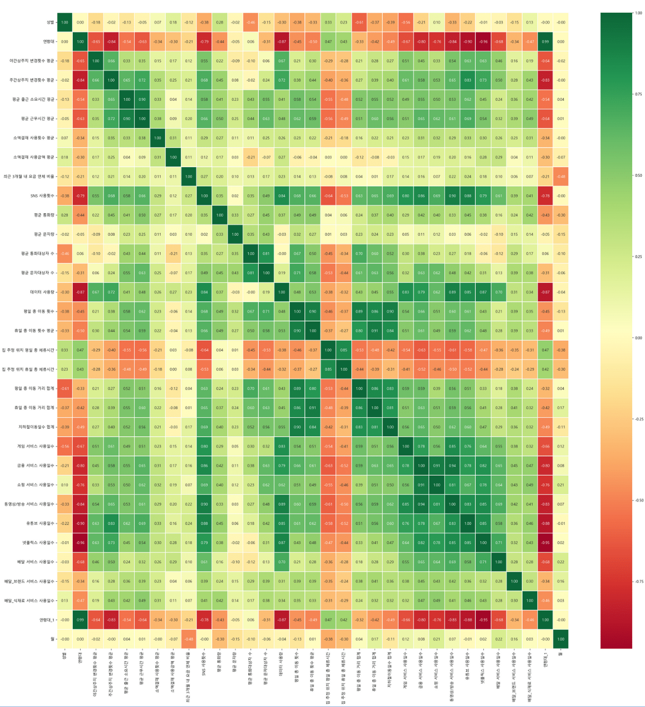
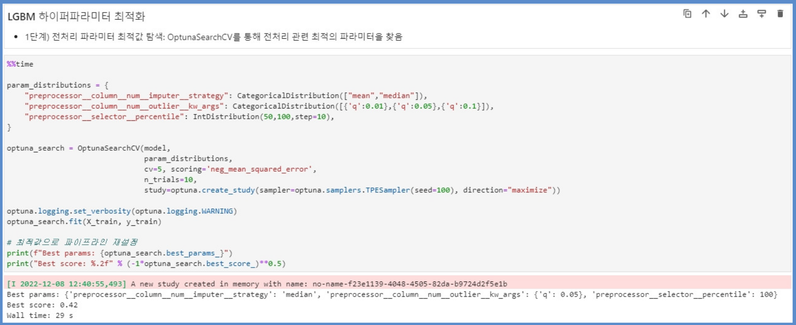
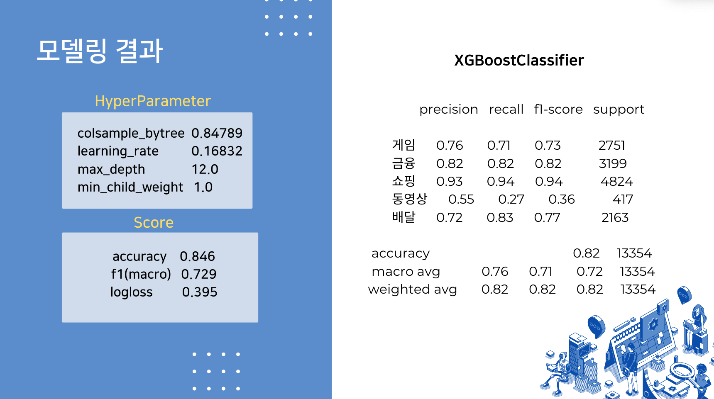

# 통신 데이터를 활용한 머신러닝 구현 (연령대 및 생활패턴 분석 및 예측)  

**팀원 : 이선영(팀장), 심재훈, 박기현, 박종혁, 신숙주**  

 
 

## 1. 프로젝트 소개

우리가 살아가는 현재는 통신의 시대입니다. 인터넷과 스마트폰의 발전으로, 전화나 문자와 같은 전통적인 통신 이외에도, 배달 앱, 인터넷 쇼핑, 이러한 서비스를 이용하기 위한 위치정보 통신 등  우리의 삶의 많은 부분이 통신과 연결이 되어있습니다.  

이러한 변화와 함께, 현대 한국 사회에서는 1인 가구의 수가 급격히 늘고 있습니다. 이러한 1인 가구들은 사회에서 큰 소비 잡단으로 주목받고 있습니다.  

본 프로젝트에서는 머신러닝을 통해 1인가구의 연령대별, 거주지역별 통신 데이터와 생활 패턴 사이의 연관성을 찾아보고, 예측해보는 것을 목표로 하였습니다.  

### 📁 함께 보면 좋을 자료  

* 발표자료 : [발표자료.pdf](./presentation.pdf)  
* 프로젝트 계획서 : [프로젝트 계획서.pdf](./src/pm/plan.pdf)  

 
 

## 2. 데이터 

본 프로젝트는 서울시와 SK 텔레콤이 함께 만든, 통신데이터 기반 1인가구의 생활특성 정보입니다.  

* 생활특성 정보 : 쇼핑서비스 이용 횟수, 출근 소요시간, 평균 근무시간, 평균 커뮤니케이션 빈도, 평일 외출 횟수 등  
* 2022년 1월 ~ 9월까지의 데이터  
* 거주지와 연령대별로 범주화되어있음  
* 총 칼럼 수 143개  
* 데이터 수는 91,584개  

### 2-1. 데이터셋 다운로드  

* 서울 시민생활 데이터  
[https://data.seoul.go.kr/dataVisual/seoul/seoulLiving.do](https://data.seoul.go.kr/dataVisual/seoul/seoulLiving.do)  

### 2-2. 데이터 전처리  

**이상치 제거**  

각 칼럼마다 이상치를 IQR 방식으로 제거를 했습니다.  
원 데이터 91,584개 -> 이상치 제거 후 61,488개  

  

 
 

## 3. 분석 및 예측  

본 프로젝트에서는 총 3가지 다른 분석/예측을 진행했습니다.  

각각의 분석/예측은 목표에 맞춰 다른 머신러닝 모델을 사용했고, 데이터에 대한 추가 전처리를 하는 경우도 있었습니다. 이에 대해서는 아래에서 각각 소개해드리겠습니다.  

 

### 3-1. 통신데이터를 통한 연령대 예측  

연령대 예측은 다양한 분야에서 중요한 역할을 합니다. 특히, 기업이나 정부 기관에서는 연령대에 따라 다른 소비 패턴, 생활 습관 등을 파악하여 이를 기반으로 전략을 수립합니다.  

이를 위해 통신 데이터를 활용하는 것이 효과적입니다. 통신 데이터는 우리의 일상 생활에서 발생하는 모든 통화, 문자, 데이터 사용량 등을 기록하고 있고, 이를 통해 연령대 예측의 정확도가 높아질 수 있기 때문입니다.  

본 섹션에서는 통신 데이터를 통해 연령대를 예측해보고, 이 결과물이 우리에게 무엇을 시사해줄 수 있는지를 탐색해보았습니다.  

**사용 모델**  

**변수 선정**

**추가 전처리 : Encoding, Scaling**

**튜닝**

**결과**
  
  

 

### 3-2. 평균 문자 대상자 수 예측  

**사용 모델 : Light GBN**  

**변수 선정**  
변수간 상관관계 분석을 통해 주요 변수를 추출했습니다.  
* 평균 근무시간  
* 평균 통화대상자 수  
* 평일 총 이동 횟수  
* 평일 총 이동 거리 합계  
* 휴일 총 이동 거리 합계  
* 금융 서비스 사용일수  
* 쇼핑 서비스 사용일수  
  
  

**파이프라인 구축**  
파이프라인 구축을 통해 여러 estimator를 하나로 연결해 "하나의 머신러닝 모델" 을 만드는 작업을 했습니다.  

  

**추가 전처리:수치형, 범주형 변수 분리**  
파이프라인에서 수치형 변수와 범주형 변수를 따로 핸들링 할 수 있도록 분리를 진행하였습니다.  

  

**튜닝**  

모델 튜닝은 총 세 단계로 진행하였으며, 아래와 같습니다.  

1. OptunaSearchCV를 통해 전처리 관련 최적의 하이파라미터 탐색  
2. LGBM 모형 최적화: Optuna의 LightGBMTunerCV을 통한 하이퍼파라미터 최적화  
3. 최적화 된 하이퍼파라미터로 *OOF를 수행하여 최종 LGBM 모형 생성  

  
  
  

**결과**  

  

 

### 3-3. 연령대별 주요 이용 서비스 예측  

여러분이 광고사업자라고 생각해봅시다. 가장 큰 고민이 무엇일까요?  

바로 누굴 대상으로 어디에 광고를 해야 효율이 좋을까.. 하는 것일 겁니다. 불특정 다수에게 광고를 하는 것 보다는, 해당 서비스에 대한 구매율이 높은 연령대, 지역에 광고를 하는 게 더욱 효율이 좋을 것입니다.

본 섹션에서는 특정 연령대, 자치구에 어떤 서비스를 광고해야 효율이 좋을지를 분석하고 예측해보았습니다.  

 

**사용 모델 : XGBoost**  

익스트림-그레디언트 부스팅의 줄임말로, 기존의 그레디언트 부스팅의 성능과 처리 속도를 향상시킨 모델입니다. 일반적으로 그레디언트 부스팅과 구조가 동일하지만, 여기에 잔차로부터 훈련한 트리를 추가해 약한 학습기를 강력한 학습기로 바꾸게 됩니다.   

그레이디언트 부스팅은 랜덤 포레스트의 알고리즘이 가진 여러 결점을 보완하는 매력적인 대안으로, 예측 분석 도구 상자 안에 있는 강력한 기술입니다. XGBoost는 그런 그레이디언트 부스팅 중에서 매우 유연하고 성공적으로 구현된 고급 기술입니다.  

 이러한 XGBoost는 이미 산업계와 학계 모두에서 중요한 위치를 차지하고 있을 뿐만 아니라, 수치형과 범주형 특성을 포함한 구조적인 테이블 형태 데이터를 기반으로 하는 데이터 분석 대회에서 꾸준히 최고 성능의 알고리즘으로 선정되고 있습니다.  

 >*Reference:https://m.hanbit.co.kr/media/channel/view.html?cms_code=CMS7895414616*  
 *이 글은 "XGBoost와 사이킷런을 활용한 그레이디언트 부스팅" 도서 내용 일부를 발췌 편집하여 작성되었습니다.*

 

**독립변수 후보 선정**  

통신 데이터의 많은 변수 중 배달, 쇼핑 등 광고효과를 볼 수 있는 서비스들을 독립변수 후보로 선정하였습니다.  

  

**튜닝 : fmin 함수를 통한 파라미터 튜닝**  

  

**결과**  

  

 
 

## 4. 소회 및 기타 정보   

  

### 🔨 기술 스택  
- Python 3.9.0  

### 👥 팀 구성원

|팀원 1|팀원 2|팀원 3|팀원 4|팀원 5|
|:---:|:---:|:---:|:---:|:---:|
|
<strong>이선영(팀장)</strong> * 데이터 수집 * 데이터 전처리 * Decision Tree 모델 구축
|<strong>심재훈</strong> * 데이터 수집 * 데이터 전처리 * Light GBM 모델 구축|<strong>박기현</strong> * 데이터 수집 * 데이터 전처리 * XGBosst 모델 구축|<strong>박종혁</strong> * 데이터 전처리 * 데이터 간 관계도 분석|<strong>신숙주</strong> * 데이터 수집 * 프로젝트 기획|

 
 
