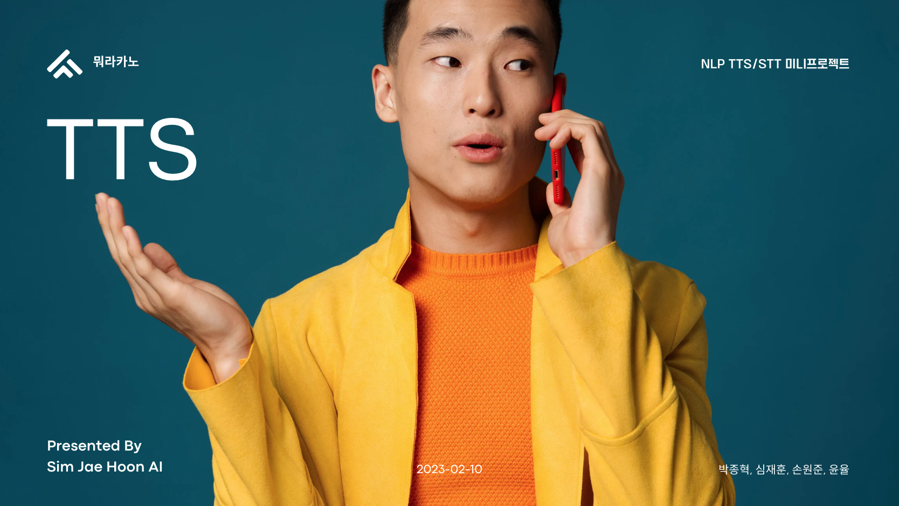

# 사투리 TTS-STT 서비스, 자기 음성 TTS 서비스

**뭐라카노 팀 : 윤율, 심재훈, 박종혁, 손원준**  

 
 

## 1. 프로젝트 소개

 

### ⚙️ 주요 기능  

**사투리 TTS - STT**  
* 텍스트를 강원도, 경상도, 전라도, 제주도, 충청도 사투리 음성으로 변환해주는 기능  
* 음성으로 변환된 자료의 Sequence, Mel-Mpectogram 을 출력해주는 기능  

**자기 음성 TTS**  
* 텍스트를 학습된 음성(자신 혹은 특정 타인의 음성 가능)으로 변환해주는 기능  

 

### 📁 함께 보면 좋을 자료  

* 발표자료 : [발표자료.pdf](./presentation_with_script.pdf)  
* 프로젝트 계획서 : [프로젝트 계획서.pdf](./src/pm/plan.pdf)  

 
 

## 2. 데이터셋 다운로드

* 사투리(방언) 발화 음성 및 텍스트 데이터  
[한국어 방언 발화(강원도)](https://aihub.or.kr/aihubdata/data/view.do?currMenu=115&topMenu=100&aihubDataSe=realm&dataSetSn=118)  
[한국어 방언 발화(경상도)](https://aihub.or.kr/aihubdata/data/view.do?currMenu=115&topMenu=100&aihubDataSe=realm&dataSetSn=119)  
[한국어 방언 발화(전라도)](https://aihub.or.kr/aihubdata/data/view.do?currMenu=115&topMenu=100&aihubDataSe=realm&dataSetSn=120)  
[한국어 방언 발화(제주도)](https://aihub.or.kr/aihubdata/data/view.do?currMenu=115&topMenu=100&aihubDataSe=realm&dataSetSn=121)  
[한국어 방언 발화(충청도)](https://aihub.or.kr/aihubdata/data/view.do?currMenu=115&topMenu=100&aihubDataSe=realm&dataSetSn=122)

 
 

## 3. Train / Inference / 실행  

### 3-1. 사투리 tts  

자세한 사용법은 사투리 tts train README 파일을 참고해주세요.  

[사투리 tts train](./satoori_tts_train/)  
[사투리 tts 가상환경](./satoori_tts_train/satoori.yaml)  

### 3-2. 사투리 tts Flask Web  

[사투리 tts Flask Web](./satoori_tts_web/)  

###  3-3. 자기음성 tts  

자세한 사용법은 각 파일 주석을 참고해주세요  

[자기음성 tts](./custom_tts/)  
[(1)glow tts](./custom_tts/train-glowtts-v2.ipynb)  
[(2)hifigan](./custom_tts/train_hifigan_v2.ipynb)  
[(3)inference](./custom_tts/infer_v2.ipynb)  

 
 

## 4. 실행 결과 : tts 변환 결과  

[발표를 대신 진행한 재훈봇 음성자료](./src/result/)  

 
 

## 5. 프로젝트를 마치며

### 프로젝트 결론  

음성 생성형 기술의 경우 자연어나 영상 기술과 비교했을 때 특히 도드라지는 점이 있습니다.  
바로 사람이 직접 경험해보고 평가하는 게 필요한 기술이라는 것입니다.  

### 🔨 기술 스택  
- Python 3.9.0  
- Flask 2.2.2  
- HTML5  

### 👥 팀 구성원

|팀원 1|팀원 2|팀원 3|팀원 4|
|:---:|:---:|:---:|:---:|
|
<strong>박종혁</strong> * 플라스크 백엔드 구현 * 사투리 tts 플라스크 탑재
|<strong>윤율</strong> * 기획 * 프로젝트 매니징|<strong>심재훈</strong> * 사투리 tts 구현 * 자기 음성 tts 구현|<strong>손원준</strong> * 음성기술 원리 연구 * 데이터 관리|
|whdrns2013@naver.com [블로그](https://whdrns2013.github.io/) [깃허브](https://github.com/whdrns2013/)|||

 
 