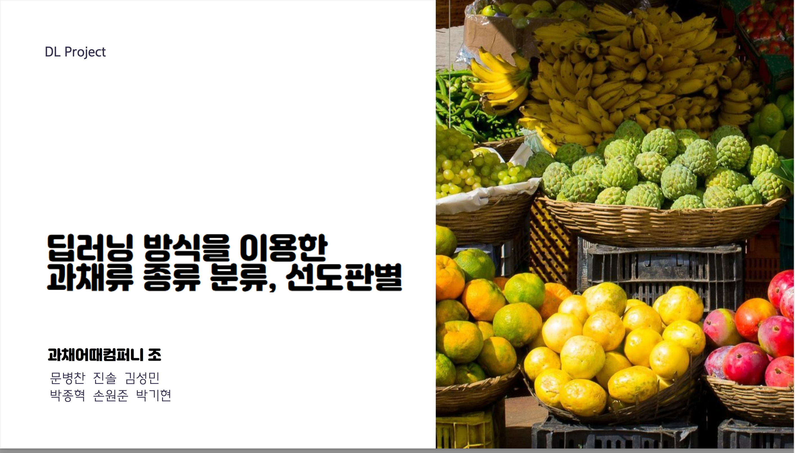
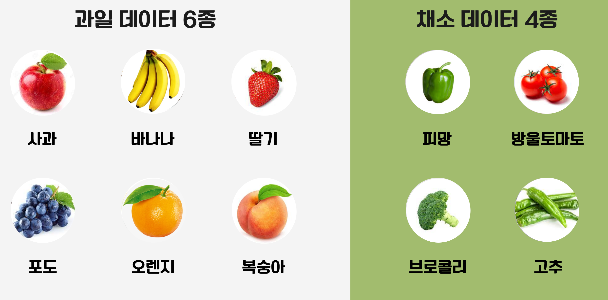
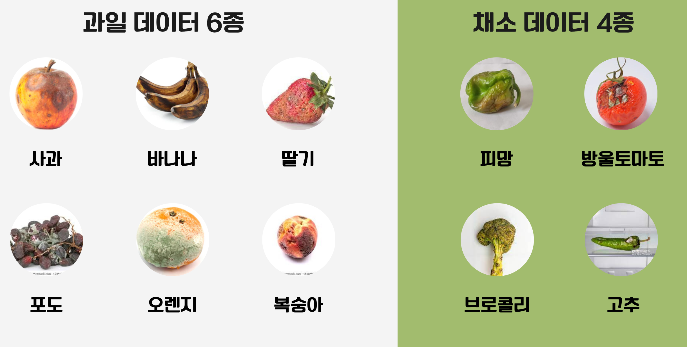
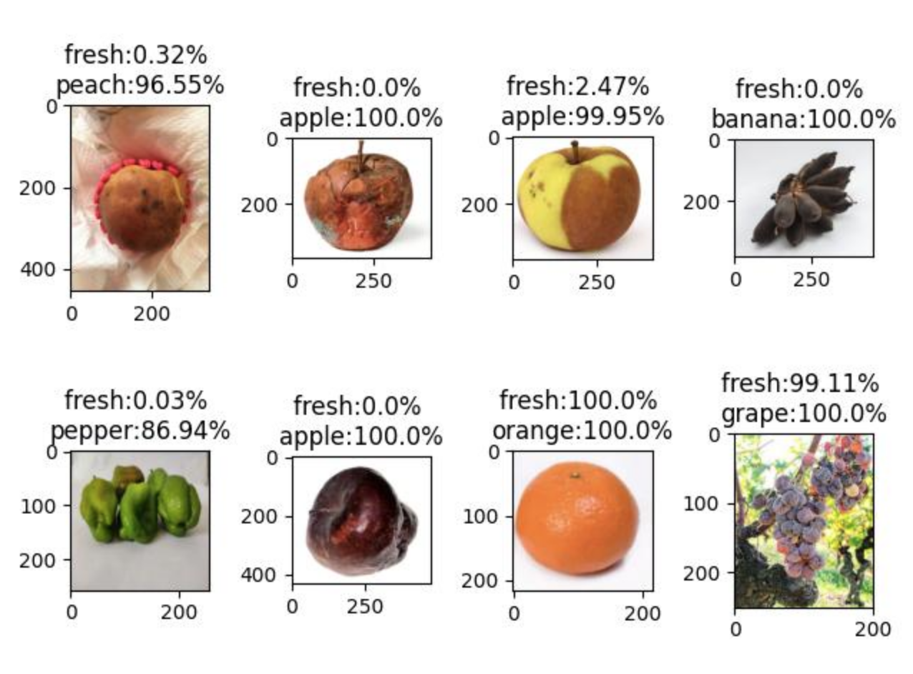

# 딥러닝 방식을 이용한 과채류 종류 분류, 선도판별  

**과채어때 팀 : 박종혁, 문병찬, 진솔, 김성민, 손원준, 박기현**  

 
 

## 1. 프로젝트 소개

<i>본 프로젝트는 "딥러닝을 이용한 과채류의 등급 자동 평가 장치"의 하위 프로젝트로 진행되었습니다.</i>  

마트에서 장을 볼 때마다 항상 드는 의문이 있습니다. "내가 먹는 과일, 채소는 과연 좋은 걸까? 더 좋은 식재료를 찾을 수 있는 방법은 없을까?" 본 프로젝트는 이 의문에서부터 시작하였습니다.  

생물인 이상 식생활을 해야하고, 당연히 좋은 먹거리를 찾게 됩니다. 하지만 우리는 농부나 농산물 경매사처럼 전문적인 지식을 가지고 있지 않기 때문에, 어떤 식재료가 좋은 식재료인지 쉽사리 알기 힘듭니다. 다만 꼭지가 싱싱한지 봐야한다 등의 몇 가지 지식을 통해 구별해볼 뿐이죠.  

소비자들이 더 현명하게 좋은 식재료를 선택할 수 있도록 과채류의 선도판별 및 종류판별 기능을 구현하는 것을 본 프로젝트의 목표로 설정했습니다. 농부나 농산물 경매사처럼 전문적인 지식을 가지고 있지 않은 일반인들에게도 쉽게 이용할 수 있는 서비스를 제공하여, 좋은 식재료를 찾는 고객들의 불편을 해소하는 데에 기여하고자 합니다.  

이를 위해 각 구성원이 모두 과채 종류 및 선도 판별 모델을 구축해보고, 성능 비교를 통해 가장 나은 모델을 선출하고 이에 대한 서비스화를 구상해보았습니다.

 

### ⚙️ 주요 기능  

* 과채류 종류 분류  
* 과채류 신선도 평가(좋음/나쁨)  

 

### ⚙️ 주요 기능 상세 소개  

**1. 과채류 종류 분류**  
영상에 있는 객체가 이 중 어떤 과채에 해당하는지 분류하는 기능입니다. 실생활에서 쉽게 접할 수 있는 과일 6종과 채소 4종을 선정하였으며, 과일은 사과, 바나나, 딸기, 포도, 오렌지, 복숭아 그리고 채소는 피방, 방울토마토, 브로콜리, 고추를 선정하였습니다.

**2. 과채류 신선도 평가(좋음/나쁨)**  
탐지된 객체의 신선도가 좋은지 나쁜지를 분류하는 기능입니다. 앞서 언급한 총 10종의 과채류들에 대해 신선도 좋음/나쁨으로 나누게 됩니다.

 

### 📁 함께 보면 좋을 자료  

* 발표자료 : [발표자료.pdf](./presentation.pdf)  
* 프로젝트 계획서 : [프로젝트 계획서.xlsx](./src/pm/plan.hwp)  

 
 

## 2. 데이터셋 다운로드

* Kaggle Fresh and Stale Images of Fruits and Vegetables Dataset.  
[https://www.kaggle.com/datasets/raghavrpotdar/fresh-and-stale-images-of-fruits-and-vegetables](https://www.kaggle.com/datasets/raghavrpotdar/fresh-and-stale-images-of-fruits-and-vegetables)  

* Mendeley Data VegNet: Vegetable Dataset with quality  
[https://data.mendeley.com/datasets/6nxnjbn9w6](https://data.mendeley.com/datasets/6nxnjbn9w6)   

 
 

## 3. Train / Test / Inference  

[단일 출력 모델](./model/single_output_model_jinsol.ipynb)  
[이중 출력 모델 1](./model/double_output_model_jonghyuk.ipynb)  
[이중 출력 모델 CNN](./model/double_output_model_parkgihyean.ipynb)  
[전이학습 Resnetv2](./model/transfer_resnetv2_sungmin_aug_2_w_gihyeon.ipynb)  

 
 

## 4. 각 모델 설명 / 평가  

### 4-1. 단일 출력 모델  

직접 layer 층을 쌓은 모델로, output 층이 하나인 단일 출력 모델입니다.  
따라서 과채의 종류 및 선도에 대한 평가를 하나의 흐름으로 처리합니다.  
모델은 신선한 사과, 썩은 사과, 신선한 오렌지, 썩은 오렌지 와 같이 과채 종류와 선도를 하나의 Label로 평가하게 됩니다.  

 모델 도식 펼치기 / 접기 

<image src = "./src/images/model_single_output_01.png"/>

 모델 평가표 펼치기 / 접기 

<image src = "./src/images/evaluation_single.png"/>

 

### 4-2. 이중 출력 모델 1  

직접 layer 층을 쌓은 모델로, output 층이 두개인 이중 출력 모델입니다.  
따라서 과채의 종류와 선도를 각각 평가하게 됩니다.  
모델은 <사과, 오렌지, 바나나> 같은 과채 분류와 <신선함, 썩음> 같은 선도 평가를 각각 따로 하게 됩니다.  

 모델 도식 펼치기 / 접기 

<image src = "./src/images/model_double_output_01.png"/>

 모델 평가표 펼치기 / 접기 

<image src = "./src/images/evaluation_double_1.png"/>

 

### 4-3. 이중 출력 모델 2  

직접 layer 층을 쌓은 모델로, output 층이 두개인 이중 출력 모델입니다.  
위 이중 출력 모델과는 데이터 학습 과정이 다릅니다.  
위 이중 출력 모델은 과채 판별과 선도 판별을 아예 모두 다른 층에서 진행됩니다.  
이 4-3 이중 출력 모델은 과채 판별과 선도 평가에 대한 학습을 모두 같은층에서 한 뒤, 최종 출력만을 두 가지로 나누어 출력하게 됩니다.  

 모델 도식 펼치기 / 접기 

<image src = "./src/images/model_double_output_02.png)"/>

 모델 평가표 펼치기 / 접기 

<image src = "./src/images/evaluation_double_2.png"/>

 

### 4-4. 전이학습 ResNetv2

ResNetv2를 전이학습한 모델입니다. 수많은 층으로 이루어져있기 때문에 아래의 모델 구성도는 요약본으로만 보실 수 있습니다. ResNetv2는 현재 가장 뛰어난 영상 분류 모델 중 하나입니다.  

 모델 도식 펼치기 / 접기 

<image src = "./src/images/model_resnet_01.png)"/>

 모델 평가표 펼치기 / 접기 

<image src = "./src/images/evaluation_resnet.png"/>

 

### 4-5. 모델들 최종 평가  

분류 정확도에 있어 Resnet 전이학습 모델이 가장 좋은 성능을 내었습니다. 학습을 10회 정도의 적은 에폭을 돌렸음에도 불구하고 100에폭 이상 학습을 진행한 타 모델보다도 훨씬 좋은 성능을 보였습니다.  

 
 

## 5. 프로젝트 관련 기타 사항  

### 🔨 기술 스택  
- Python 3.9.0  

### 👥 팀 구성원

|팀원 1|팀원 2|팀원 3|팀원 4|팀원 5|팀원 6|
|:---:|:---:|:---:|:---:|:---:|:---:|
|
<strong>박종혁(팀장)</strong> * 이중 출력 모델 구축
|<strong>문병찬</strong> * Data Augment|<strong>진솔</strong> * 단일 출력 모델 구축|<strong>김성민</strong> * ResNet 전이 학습|<strong>손원준</strong> * 데이터수집 * 프로젝트 관리 * normalization|<strong>박기현</strong> * 이중 출력 모델 구축 * ResNet 전이 학습|
|whdrns2013@naver.com [블로그](https://whdrns2013.github.io/) [깃허브](https://github.com/whdrns2013/)||||||

 
 