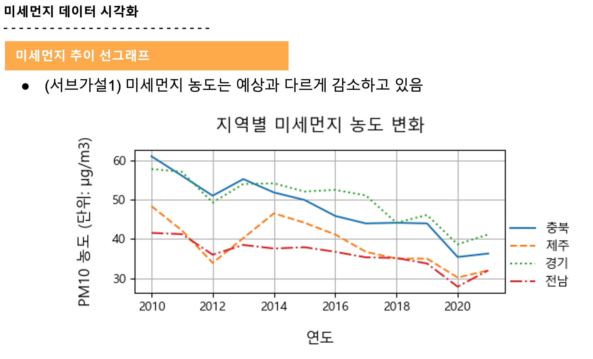
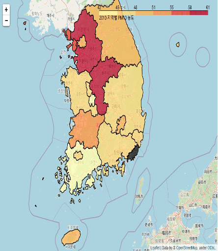

# 미세먼지와 폐암발생률 상관관계 분석 및 시각화

**귤처럼 상큼한 4조 팀 : 박종혁, 문병찬, 최은진, 이충흔**  

 
 

## 1. 프로젝트 소개

### 1-1. 프로젝트 개요  

미세먼지는 폐암 발생의 주요 원인으로 지목되고 있습니다.  
본 프로젝트에서는 2010년부터 최근까지의 전국 미세먼지 농도 추이와 폐암 발생 수 추이를 분석해 보고, 그 관계성과 위험성을 확인해보았습니다.    

 

### 📁 1-2. 함께 보면 좋을 자료  

* 발표자료 : [발표자료.pdf](./presentation.pdf)  
* 프로젝트 계획서 : [프로젝트 계획서.hwp](./src/pm/plan.pdf)  

 
 

## 2. 준비

### 2-1. 데이터셋 다운로드  

* 미세먼지 pm10 농도  
[https://kosis.kr/statHtml/statHtml.do?orgId=106&tblId=DT_106N_03_0200045](https://kosis.kr/statHtml/statHtml.do?orgId=106&tblId=DT_106N_03_0200045)  

* 미세먼지 pm2.5  
[https://kosis.kr/statHtml/statHtml.do?orgId=106&tblId=DT_106N_03_0200145&conn_path=I2](https://kosis.kr/statHtml/statHtml.do?orgId=106&tblId=DT_106N_03_0200145&conn_path=I2)  

* 행정구역별 인구수  
[https://kosis.kr/statHtml/statHtml.do?orgId=101&tblId=DT_1B040A3&vw_cd=MT_ZTITLE&list_id=A_7&scrId=&seqNo=&lang_mode=ko&obj_var_id=&itm_id=&conn_path=MT_ZTITLE&path=%252FstatisticsList%252FstatisticsListIndex.do](https://kosis.kr/statHtml/statHtml.do?orgId=101&tblId=DT_1B040A3&vw_cd=MT_ZTITLE&list_id=A_7&scrId=&seqNo=&lang_mode=ko&obj_var_id=&itm_id=&conn_path=MT_ZTITLE&path=%252FstatisticsList%252FstatisticsListIndex.do)  

* 시도별 전체 중증 암 등록환자의 암유형별 등록인원 현황  
[https://kosis.kr/statHtml/statHtml.do?orgId=350&tblId=DT_35001_A090](https://kosis.kr/statHtml/statHtml.do?orgId=350&tblId=DT_35001_A090)  

* 광역시도 경계 GeoJson  
[http://www.gisdeveloper.co.kr/?p=2332](http://www.gisdeveloper.co.kr/?p=2332)  

### 2-2. 기타 툴

* SVH -> JSON 변환  
[https://mapshaper.org/](https://mapshaper.org/)  

 
 

## 3. 코드  

[데이터 전처리](./vis_data_processing.ipynb)  
[시각화](./visualization_result.ipynb)  
[기상청 API 연동 및 날씨 지도시각화](./vis_todays_forecast.ipynb)  

 
 

## 4. 시각화  

### 4-1. 폐암환자 관련 시각화  

**연도-지역별 폐암 발병률**  
   

**연도-지역별 폐암 발병률 추이 지도**  
   

**총인구당 폐암환자 비율 박스플롯**  
  

### 4-2. 미세먼지 관련 시각화  

**연도-지역별 미세먼지 농도 변화**  
  

**연도-지역별 미세먼지 추이 지도**  
  

**연도별 미세먼지 상/하위 3개 지역 그래프**  
  

**연도별 미세먼지 추이 박스플롯(PM2.5, PM1.0)**  
  
  

### 4-3. 미세먼지와 폐암간 상관관계 시각화  

**연도별 미세먼지-폐암 추이 선 그래프**  
두 개의 Y축을 가진 그래프로 시각화 진행  
  

**연도별 미세먼지, 폐암 상관관계 산점도 그래프**  
regplot으로 경향성과 상관관계를 파악  
  

 
 

## 5. 프로젝트를 마치며

### 프로젝트 결론  

미세먼지와 폐암의 특별한 연관성을 찾을 수는 없었습니다.  
폐암 발병률은 시간이 갈 수록 늘어나는 추세이지만, 미세먼지 농도는 시간이 갈수록 줄어드는 추세에 있습니다.  

하지만 우리는 보통 "미세먼지 문제는 시간이 갈 수록 심해지고 있다" 라고 느끼고 있습니다.  
이는 미디어에서 미세먼지의 심각성에 대해 자주 강조해 말하면서 불안감이 증폭했기 때문일 것으로 판단하고 있습니다.  

[관련기사 : 작년 미세먼지 뉴스 3만 3000건... 국민 불안감 키웠다 - 서울 파이낸스](https://www.seoulfn.com/news/articleView.html?idxno=340101)  

여기에 더해 "미세먼지 주의 발령"은 예전보다 늘어났기 때문일 수도 있습니다. 앞서 말한대로 미세먼지 농도는 줄어들었지만, 미세먼지가 한 날에 고농도로 몰리는 '미세먼지 양극화'로 인해 체감 미세먼지 농도는 더 심해졌다는 기사를 아래 첨부합니다.  

[미세먼지, 통계는 나아졌다지만...체감은 왜?](https://news.mt.co.kr/mtview.php?no=2019030513233971214)  

이번 프로젝트에서 우리는, 시각화를 통해 현상을 더욱 쉽고 빠르게, 그리고 통찰력있게 들여다볼 수 있다는 점을 깨달았습니다. 시각화는 향후 업무 등에서도 주요한 점을 놓치지 않기 위한 툴로 활용될 수 있기에, 관련 공부를 지속 하고 새로운 기술에 대해 서로 공유하는 등 공부를 계속해나갈 것입니다.

### 🔨 기술 스택  
- Python 3.9.0  

### 👥 팀 구성원

|팀원 1|팀원 2|팀원 3|팀원 4|
|:---:|:---:|:---:|:---:|
|
<strong>박종혁(팀장)</strong> * 데이터 전처리 * 지도시각화 * 일기예보 api 연동
|<strong>문병찬</strong> * 데이터 전처리 * 박스플롯 시각화 PPT|<strong>최은진</strong> * 데이터 전처리 * 연도별 추세 그래프 * 미세먼지-폐암 상관 그래프|<strong>이충훈</strong> * 데이터 수집 * 지도시각화 * 연도별 그래프 GIF 구현|
|whdrns2013@naver.com [블로그](https://whdrns2013.github.io/) [깃허브](https://github.com/whdrns2013/)|||

 
 